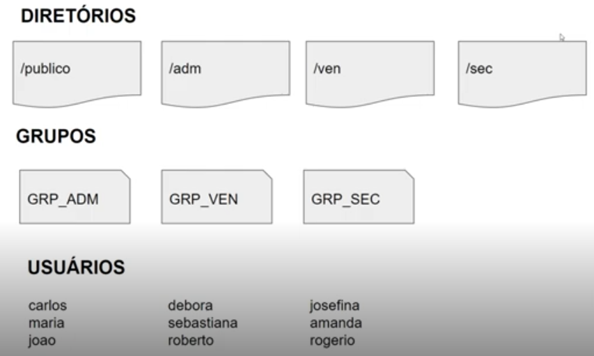

# Infraestrutura como Código: Script de Criação de Estrutura de Usuários, Diretórios e Permissões

## **Entendendo o Desafio 1**

Neste projeto iremos criar um script onde toda a infraestrutura de usuários, grupos de usuários, diretórios e permissões serão criadas automaticamente. Será realizado o upload do arquivo de script no GitHub para futuras reutilizações do script. Sendo assim, toda nova máquina virtual que for iniciada já estará pronta para uso quando o script for executado.

**Agora é a sua vez de ser o protagonista! Implemente o desafio sugerido pela expert criando um repositório próprio e, com isso, aumentando ainda mais seu portfólio de projetos no GitHub!**

## **Pré-requisitos**

* Linux
* GitHub

## Observações finais

Antes de executar o arquivo: `estrutura-usuario-grupos-permissoes.sh`, digite o comando `chmod +x estrutura-usuario-grupos-permissoes.sh`, para adicionar permissão de execução no arquivo sh.

---

### **Links Úteis**

Separamos aqui alguns materiais complementares como **artigos, apostilas, apresentações**, entre outros. Esses materiais serão úteis para você se aprofundar ainda mais nos principais temas deste Módulo e estão listados a seguir.

**Principais comandos do Linux**

* [https://www.linux.ime.usp.br/\~albasalo/Apostila/apostila.pdf](https://www.linux.ime.usp.br/~albasalo/Apostila/apostila.pdf)

**Mais informações sobre usuários no Linux:**

* [https://www.infowester.com/usuarioslinux.php](https://www.infowester.com/usuarioslinux.php)

# Infraestrutura como Código: Instalando um servidor Web

## **Descrição do Desafio**

Neste projeto iremos criar um script onde será provisionado um servidor web automaticamente. Um servidor web é um software e hardware que usa HTTP (Hypertext Transfer Protocol) e outros protocolos para responder a solicitações de clientes feitas pela World Wide Web. O principal trabalho de um servidor da web é exibir o conteúdo do site por meio do armazenamento, processamento e entrega de páginas da web aos usuários.

**Agora é a sua vez de ser o protagonista! Implemente o desafio sugerido pela expert criando um repositório próprio e, com isso, aumentando ainda mais seu portfólio de projetos no GitHub!**

## **Pré-requisitos**

* Linux
* GitHub

## **Slides e GitHub**

* [Infraestrutura como Código - Script de Provisionamento de um Servidor Web (Apache).pptx](https://hermes.dio.me/files/assets/b11bdf40-aadf-4fd9-9462-d774ee352ff2.pptx)

Neste projeto iremos criar um script onde será provisionado um servidor web automaticamente. Um servidor web é um software e hardware que usa HTTP (Hypertext Transfer Protocol) e outros protocolos para responder a solicitações de clientes feitas pela World Wide Web. O principal trabalho de um servidor da web é exibir o conteúdo do site por meio do armazenamento, processamento e entrega de páginas da web aos usuários.

## Observações finais

Antes de executar o arquivo: `instalando-Servidor-Web.sh`, digite o comando `chmod +x instalando-Servidor-Web.sh`, para adicionar permissão de execução no arquivo sh.
